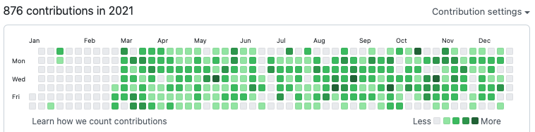

# Hive-Coding-School
An overview to my studies at Hive (Helsinki) Coding School.

## 1. My learnings at Hive Coding School

### 1.1 Overview

|Document content|Link to doc|Additional info|
| - | - | - |
| My progress at Hive | [StudiesAtHive](Doc/JuhaniKauppiStudiesAtHive_2022_02_03.pdf)| |
| Way of learing at Hive| [Hive](https://www.hive.fi/en/studies) 

### 1.2 My focus areas

| Focus area | Related projects | Additional info |
| - | - | - |
| Writing programs with C-language | Almost all projects |  |
| Graph algorithms | Push_swap, Lem_in and N-puzzle  |  |
| Machine Learning details | ft_linear_regression, DSLR, Multilayer Perceptron |  |
| Give and get feedback | All projects | An inspiring discussion of different solution alternatives |

### 1.3 Studying motivation

